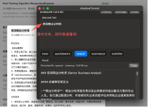

# shadowTunnel

Native macOS app that shows a floating panel for selected text and uses a configurable LLM backend for translation or search.

## Quick Start
1. Open `shadowTunnel.xcodeproj` in Xcode.
2. In Xcode, enable Accessibility permission for the app when prompted.
3. Run the app. Select text in any app, then press `Cmd+Shift+Space`.
4. The floating panel opens with the selected text. You can enable automatic translation on open in **Settings**, or click **Translate** manually.

## LLM Provider Config
The app loads `Resources/Providers.example.json` from the app bundle. You can override at runtime by storing JSON into user defaults key `shadowTunnel.config.override` (e.g., from a settings UI you add later).

Providers are configured per ID. The built-in request builder supports:
- `openai-compatible` (OpenAI-compatible chat completions)
- `qwen` (DashScope compatible-mode chat completions)
- `doubao` (Volcengine Ark chat completions)
- `gemini` (Google Gemini generateContent)

Update the `baseURL`, `apiKey`, and `model` to match your provider.
For DashScope Qwen, either base URL is accepted:
- `https://dashscope.aliyuncs.com`
- `https://dashscope.aliyuncs.com/compatible-mode`

For Doubao (Volcengine Ark), `model` is usually your endpoint ID (for example `ep-xxxxxx`).

Model selection now supports:
- suggested model presets per provider
- manual custom model input for any provider

## Permissions
- Accessibility: required to read selected text from other apps.

## Notes
This is a minimal scaffold. You can add:
- Hotkey customization UI
- Provider editor UI
- Rich response rendering
- Error banners and retry
